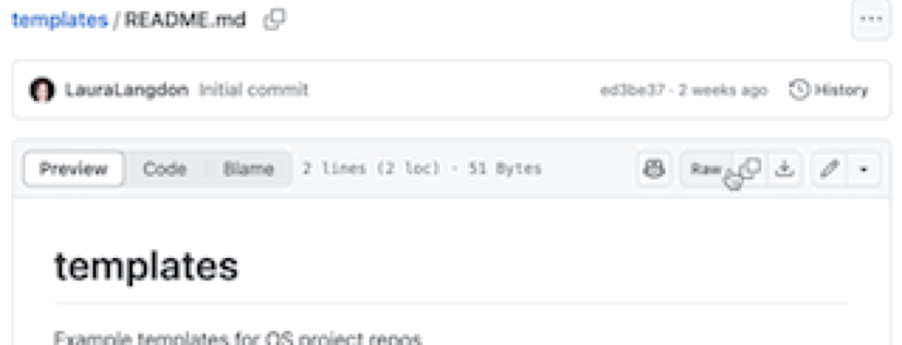

# Templates

This repo contains templates you can check out to help you build out your documentation in your project repos.

## Table of contents

- [How to use the templates](#ways-to-use-the-templates)
- [List of templates](#how-to-use-the-templates)
- [Formatting considerations](#formatting-considerations)

## How to use the templates

Click on the file name, then click the copy button. This way you'll keep the formatting! Paste the copied raw text into your own `README.md` file.

 In each section, you can replace the text with information relevant to your project; e.g. replacing the title in line 1 with your project's title.

## List of templates

- [README.md template](./README-template.md)

More coming!

## Formatting considerations

As you'll see in the templates, these files are most commonly written in [Markdown](https://www.markdownguide.org/), 

[Accessible Markdown](https://www.smashingmagazine.com/2021/09/improving-accessibility-of-markdown/)

• Headings capitalized with an initial capital, following standard English sentence rules
• Headings prefixed with #/##/### to indicate level of heading (h1/h2/h3) followed by a blank line
• Project name is the first line of the document, and only level one heading (#)
• Two lines prior to ##/### headings
• No leading or trailing spaces
• Bulleted lists denoted by dashes (-)
• Ordered lists use "1", for easier updates and to avoid errors (see Configuration)
• Nested lists indented with 4 spaces
• Links should have a meaningful link text, for example:[Drupal](https://www.drupal.org/) (i.e. not just the URL)
• Text word-wrapped within around 80 cols
